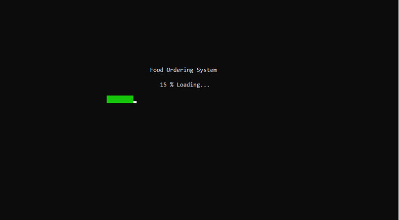

 

  <h3 align="center">Food Ordering System</h3>
  
  

    🍩 Menu-driven food ordering program. Mini-project for Data Structures, Semester-III
     
    <a href="https://github.com/SharayuBokde/food-ordering-system"><strong>Explore the docs »</strong></a>
     
     
    View Demo
    ·
    <a href="https://github.com/SakshiUppoor/food-ordering-system/issues">Report Bug</a>
    ·
    <a href="https://github.com/SakshiUppoor/food-ordering-system/issues">Request Feature</a>
  

## Team 

**_Rutu Gaglani_** - [Github](https://github.com/rutugaglani) 

**_Sakshi Uppoor_** - [Github](https://github.com/SakshiUppoor) 

**_Sharayu Bokde_** - [Github](https://github.com/SharayuBokde) 

